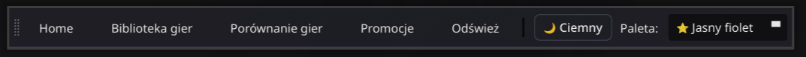
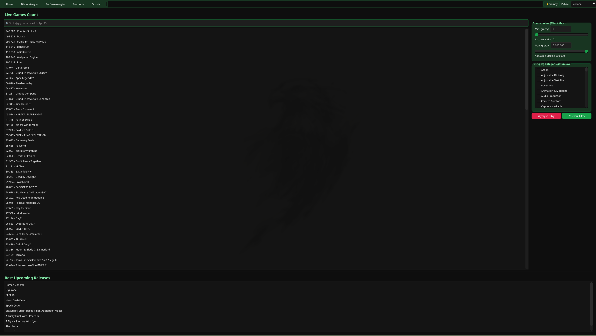
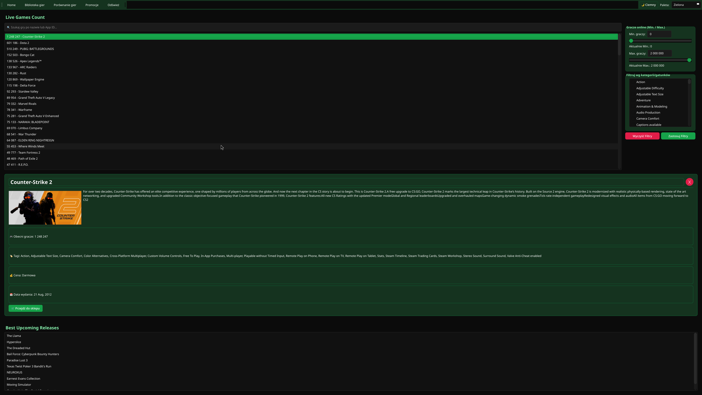
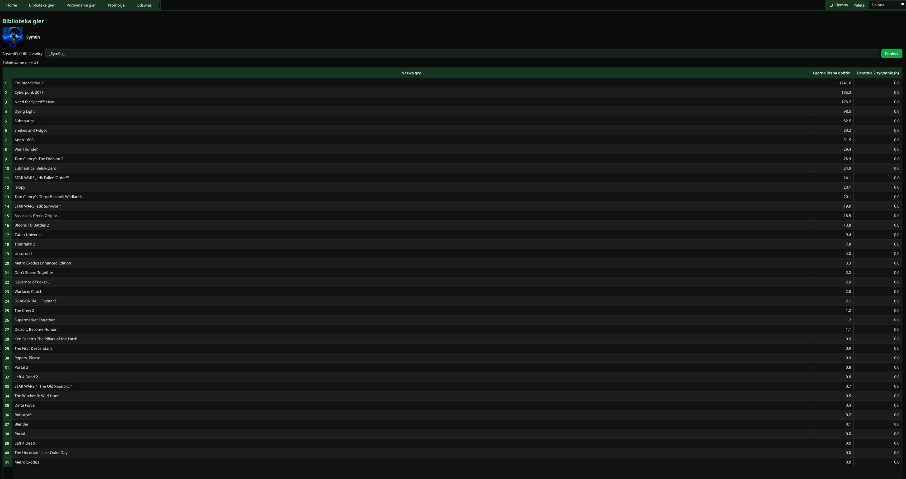
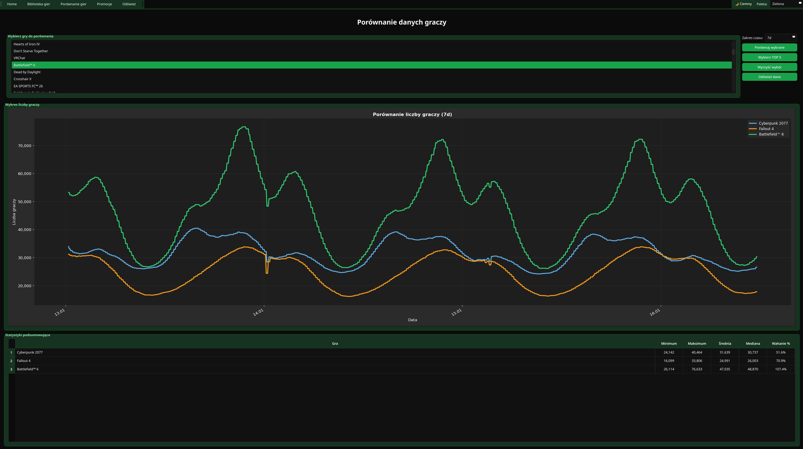
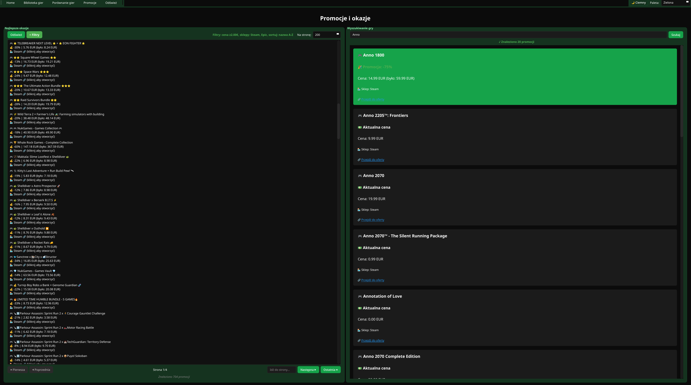
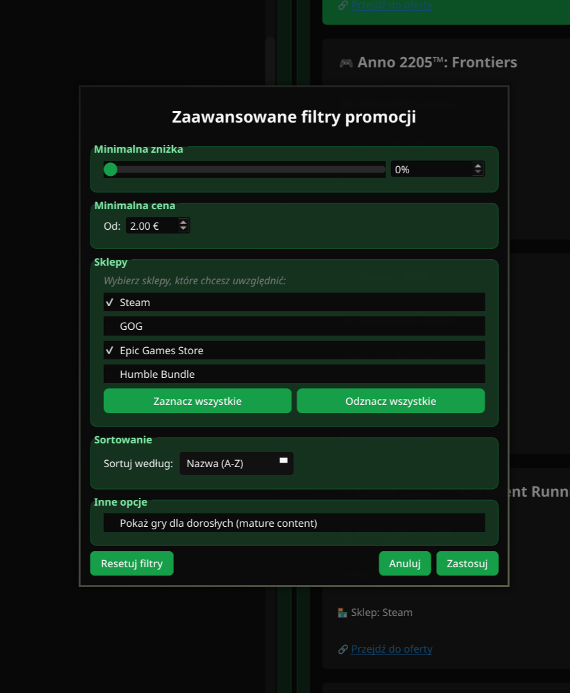
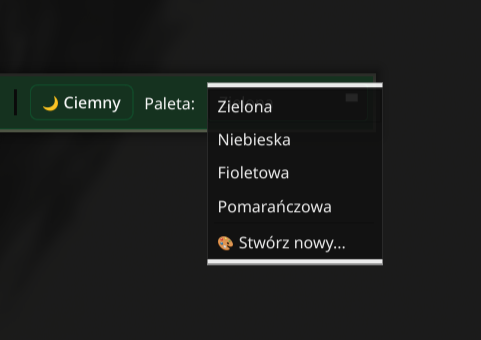
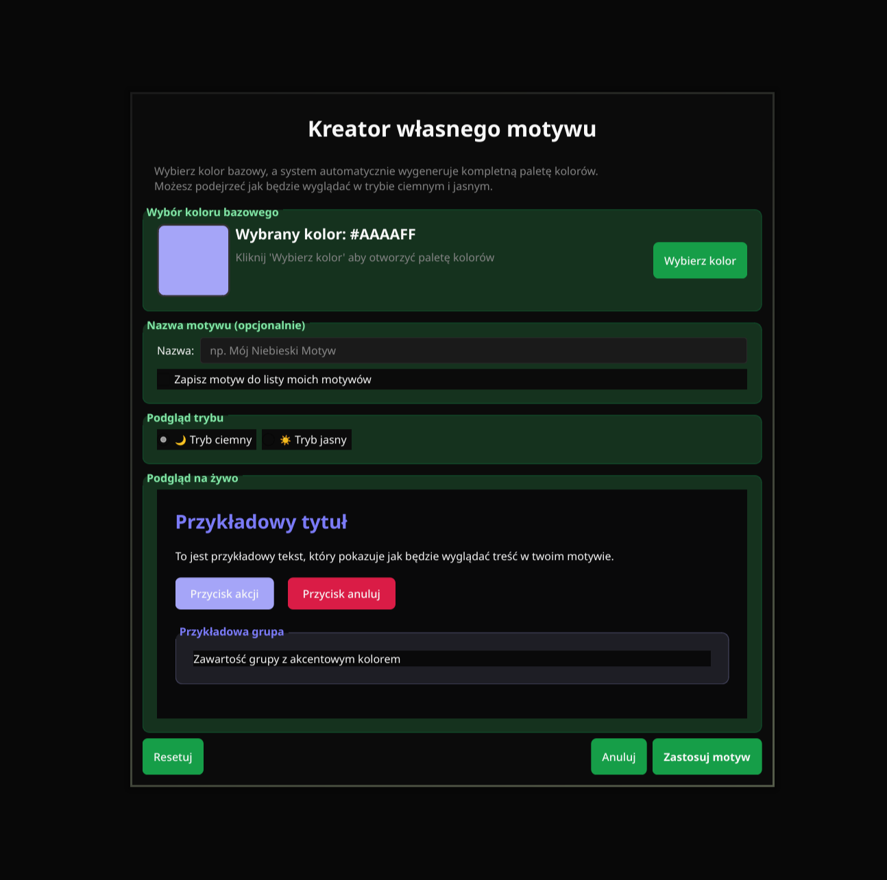
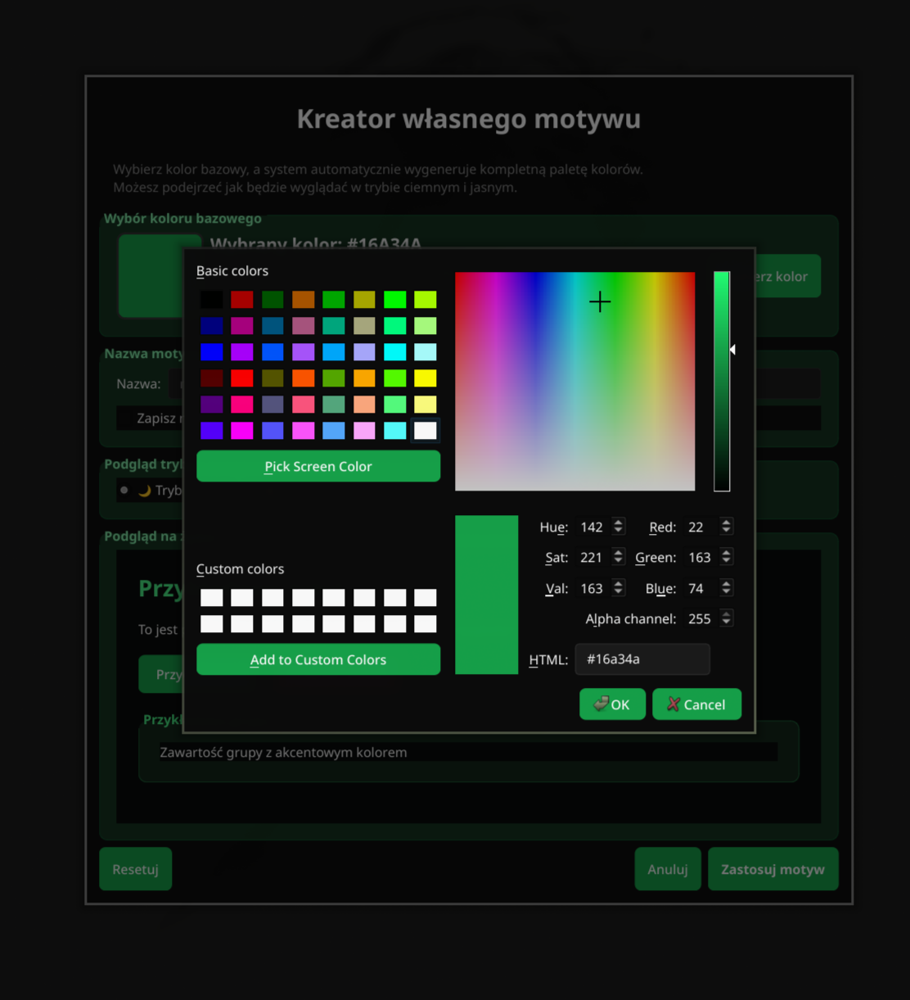

# Custom Steam Dashboard - Instrukcja Użytkownika

**Custom Steam Dashboard** to aplikacja pozwalająca na przeglądanie statystyk gier Steam, porównywanie liczby graczy, śledzenie promocji oraz przeglądanie biblioteki gier użytkownika. Wszystkie dane pobierane są z serwera backend.

---

## 📋 Spis Treści

1. [Uruchomienie aplikacji](#-uruchomienie-aplikacji)
2. [Interfejs główny](#-interfejs-główny)
3. [Widok Home - Statystyki gier](#-widok-home---statystyki-gier)
4. [Widok Biblioteka gier](#-widok-biblioteka-gier)
5. [Widok Porównanie gier](#-widok-porównanie-gier)
6. [Widok Promocje](#-widok-promocje)
7. [Personalizacja motywu](#-personalizacja-motywu)
8. [Rozwiązywanie problemów](#-rozwiązywanie-problemów)

---

## 🚀 Uruchomienie aplikacji

Aplikacja jest gotowa do użycia bezpośrednio po pobraniu. Wystarczy uruchomić plik wykonywalny:

- **Windows:** Kliknij dwukrotnie `CustomSteamDashboard.exe`
- **Linux/macOS:** Kliknij dwukrotnie `CustomSteamDashboard` lub uruchom w terminalu `./CustomSteamDashboard`

> **Uwaga:** Przy pierwszym uruchomieniu aplikacja łączy się z serwerem. Upewnij się, że masz połączenie z siecią.

---

## 🏠 Interfejs główny

Po uruchomieniu aplikacji zobaczysz okno z paskiem narzędzi u góry:

### Pasek narzędzi

- **Home** - Widok główny ze statystykami gier
- **Biblioteka gier** - Przeglądanie biblioteki użytkownika Steam
- **Porównanie gier** - Porównywanie liczby graczy między grami
- **Promocje** - Przeglądanie aktualnych promocji i okazji
- **Odśwież** - Odświeżanie danych w aktualnym widoku
- **Przełącznik motywu** *(prawy górny róg)* - Zmiana motywu aplikacji

---

## 📊 Widok Home - Statystyki gier

Główny widok aplikacji przedstawia aktualną liczbę graczy online dla obserwowanych gier.

### Funkcje:

#### 1. Lista gier z liczbą graczy
- Wyświetla aktualne statystyki liczby graczy online
- Dane odświeżane co 5 minut automatycznie
- Kliknięcie na grę otwiera szczegółowe informacje

#### 2. Panel filtrowania
**Filtrowanie po liczbie graczy:**
- Użyj suwaków "Min graczy" i "Max graczy" aby zawęzić wyniki
- Wyświetlana jest tylko gry w określonym przedziale

**Wyszukiwanie:**
- Wpisz nazwę gry w polu "Wyszukaj grę..." aby szybko odnaleźć konkretną grę

**Filtrowanie po tagach:**
- Wybierz tagi (np. Action, RPG, Strategy) aby wyświetlić tylko gry z określonymi kategoriami
- Możesz wybrać wiele tagów jednocześnie
- Kliknij "Wyczyść tagi" aby usunąć wszystkie filtry

#### 3. Szczegóły gry

Po kliknięciu na grę zobaczysz:
- Nazwę gry i aktualna liczbę graczy
- Szczegółowe informacje o grze
- Tagi i kategorie
- Link do strony Steam
- Przycisk "Otwórz w Steam" - otwiera kartę gry w przeglądarce

---

## 📚 Widok Biblioteka gier

Ten widok pozwala przeglądać bibliotekę gier dowolnego użytkownika Steam.

### Jak używać:

1. **Wprowadź identyfikator użytkownika** w polu "SteamID / URL / vanity"
   - Możesz użyć SteamID64 (np. `76561198012345678`)
   - Lub vanity name (np. `twoja_nazwa`)
   - Lub pełnego URL profilu (np. `https://steamcommunity.com/id/twoja_nazwa`)

2. **Kliknij "Pobierz"** - aplikacja pobierze bibliotekę gier

3. **Przeglądaj wyniki:**
   - Tabela wyświetla wszystkie gry użytkownika
   - **Nazwa gry** - nazwa gry
   - **Łączna liczba godzin** - całkowity czas gry
   - **Ostatnie 2 tygodnie** - czas gry w ostatnich 2 tygodniach

### Funkcje dodatkowe:

- **Sortowanie:** Kliknij nagłówek kolumny aby posortować (nazwa, czas gry)
- **Awatar i nazwa użytkownika:** Wyświetlane u góry ekranu
- **Automatyczne zapisywanie:** Ostatnio przeglądana biblioteka jest zapisywana i ładowana przy następnym uruchomieniu

---

## 📈 Widok Porównanie gier

Porównuj liczbę graczy między różnymi grami w czasie.

### Jak używać:

1. **Wybierz gry do porównania:**
   - Z listy po lewej stronie zaznacz gry (możesz wybrać wiele)
   - Przytrzymaj Ctrl/Cmd aby zaznaczyć więcej gier

2. **Wybierz zakres czasu:**
   - Użyj listy rozwijanej "Zakres czasu"
   - Dostępne opcje: 1h, 3h, 6h, 12h, 1d, 3d, 7d

3. **Kliknij "Porównaj wybrane"**

### Wyniki:

#### Wykres liczby graczy
- Interaktywny wykres pokazujący zmiany liczby graczy w czasie
- Każda gra ma inny kolor
- Możesz najechać kursorem na punkty aby zobaczyć dokładne wartości

#### Tabela statystyk
Dla każdej gry wyświetlane są:
- **Minimum** - najniższa liczba graczy w okresie
- **Maksimum** - najwyższa liczba graczy
- **Średnia** - średnia liczba graczy
- **Mediana** - mediana liczby graczy
- **Wahanie %** - procentowa różnica między min a max

---

## 💰 Widok Promocje

Przeglądaj najlepsze promocje i okazje na gry.

### Panel "Najlepsze okazje"

Wyświetla aktualne najlepsze promocje ze wszystkich sklepów.

**Funkcje:**
- **Odśwież** - pobierz najnowsze promocje
- **⚙ Filtry** - otwórz okno zaawansowanych filtrów
- **Na stronę** - wybierz ile promocji wyświetlić (50, 100, 150, 200)
- **Stronicowanie** - przełączaj się między stronami wyników

**Informacje o promocji:**
Każda pozycja wyświetla:
- Nazwę gry
- Zniżkę (np. `-75%`)
- Cenę przed i po zniżce
- Nazwę sklepu

**Kliknięcie na promocję** otwiera stronę sklepu w przeglądarce.

### Panel "Wyszukiwanie gier"

Szukaj promocji dla konkretnej gry.

**Jak używać:**
1. Wpisz nazwę gry w polu "Nazwa gry"
2. Opcjonalnie ustaw minimalną zniżkę (w %)
3. Kliknij "Szukaj"

Wyniki pokażą wszystkie dostępne promocje dla tej gry w różnych sklepach.

### Zaawansowane filtry

Kliknij **"⚙ Filtry"** aby otworzyć okno filtrowania:

**Dostępne filtry:**
- **Minimalna zniżka** - pokaż tylko promocje z określoną minimalną zniżką
- **Minimalna cena** - ukryj bardzo tanie gry
- **Sklepy** - wybierz z których sklepów wyświetlać promocje (Steam, GOG, Epic, Humble)
- **Sortowanie** - sortuj po zniżce, cenie lub dacie
- **Treści dla dorosłych** - włącz/wyłącz gry z oznaczeniem mature

Po ustawieniu filtrów kliknij **"Zastosuj"** aby zobaczyć wyniki.

---

## 🎨 Personalizacja motywu

Aplikacja oferuje możliwość dostosowania wyglądu do własnych preferencji.

### Przełącznik motywu (prawy górny róg)

**Tryb ciemny/jasny:**
- 🌙 - Tryb ciemny (domyślny)
- ☀️ - Tryb jasny

**Palety kolorów:**
- 🟢 Zielony (domyślny)
- 🔵 Niebieski
- 🟣 Fioletowy
- 🟠 Pomarańczowy
- 🎨 Własny motyw

### Tworzenie własnego motywu

Kliknij **"🎨 Własny motyw..."** aby otworzyć kreator:

1. **Wybierz kolor bazowy:**
   - Kliknij "Wybierz kolor"
   - Użyj palety kolorów lub wpisz kod HEX

2. **Podejrzyj wygląd:**
   - Przełączaj między trybem ciemnym i jasnym
   - Zobacz jak wyglądają przyciski, tekst i akcenty

3. **Nazwij motyw:**
   - Wpisz unikalną nazwę dla swojego motywu

4. **Zapisz:**
   - Kliknij "Zapisz i zastosuj" aby użyć motywu
   - Motyw zostanie zapisany i dostępny w przełączniku

**Zarządzanie motywami:**
- Zapisane motywy możesz usunąć zaznaczając "Usunąć istniejący motyw o tej nazwie"
- Możesz nadpisać istniejący motyw podając tę samą nazwę

---

**Wersja dokumentacji:** 2.0  
**Data aktualizacji:** 2026-01-16

