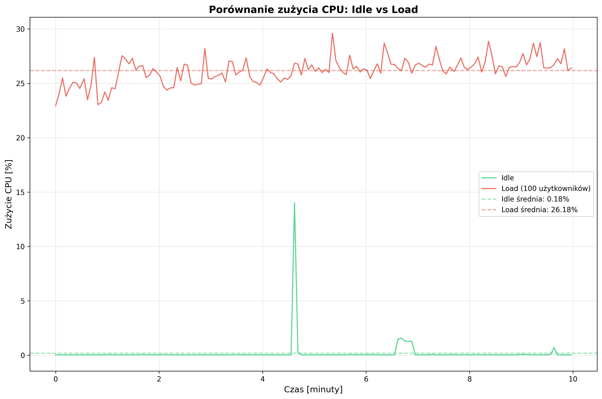
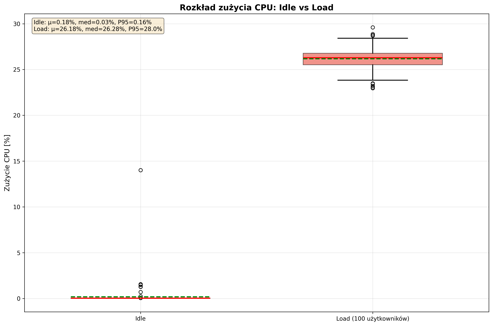
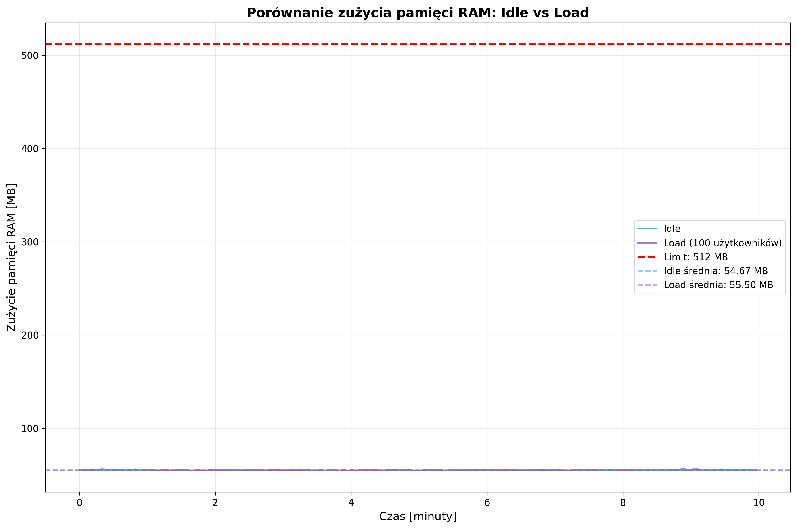
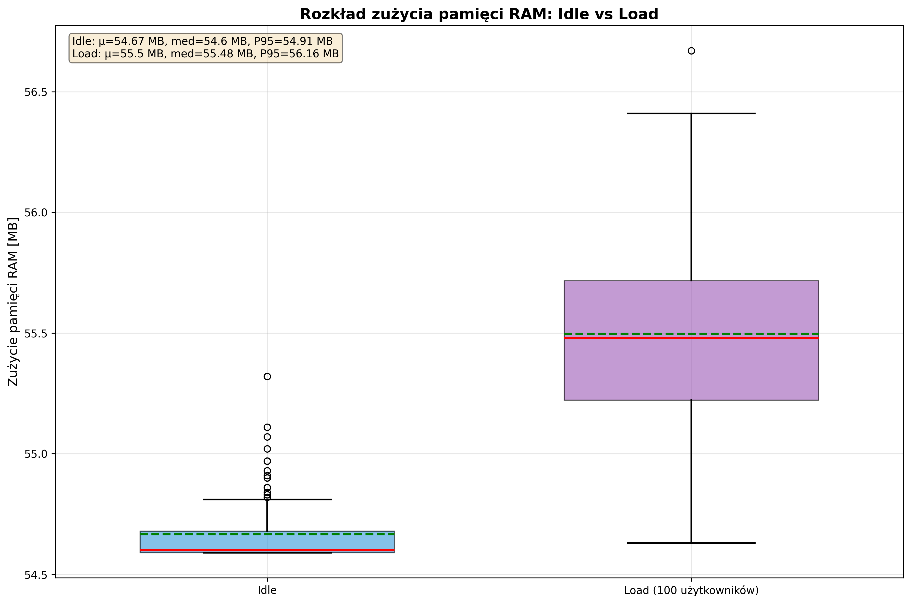
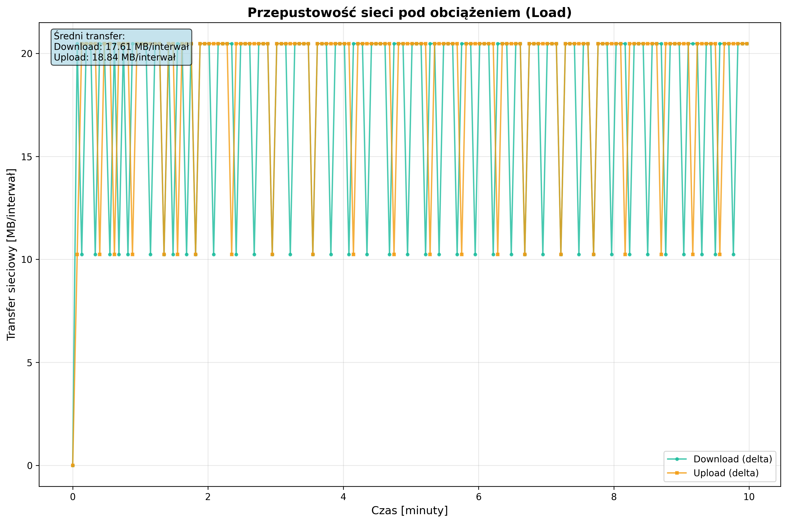
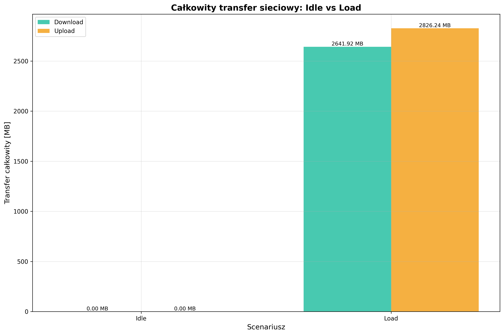
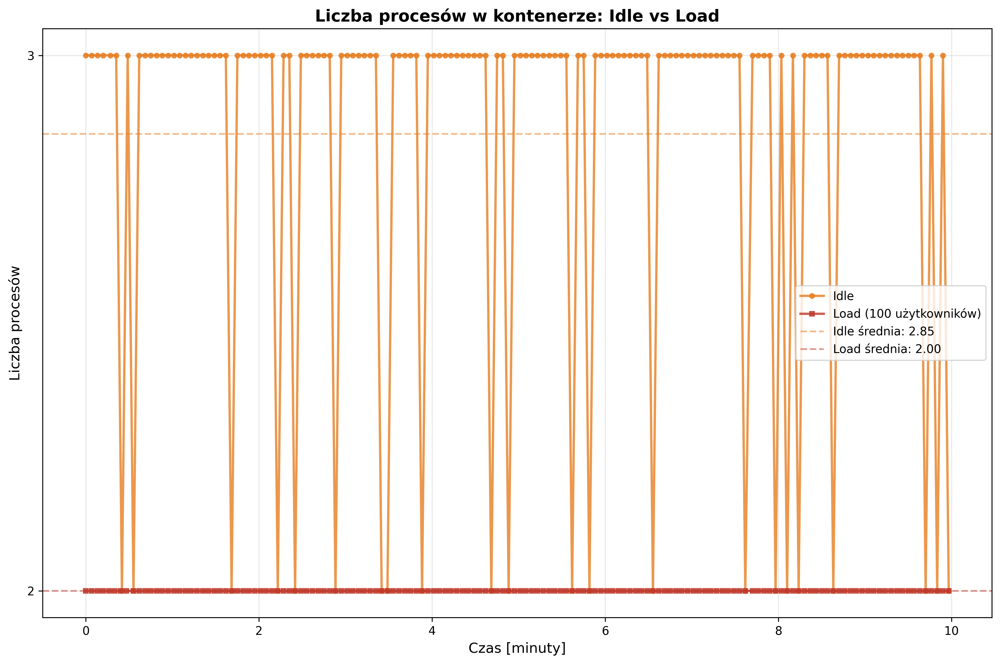
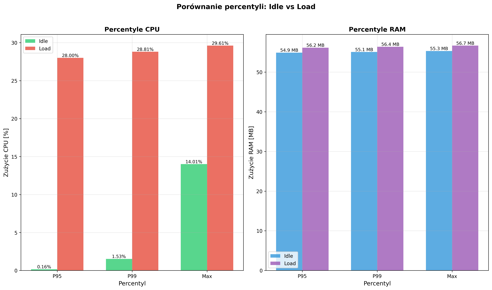

# 📊 Raport wydajnościowy: Custom-Steam-Dashboard

**Data wygenerowania:** 2026-01-11 21:20:11

---

## 📋 Streszczenie wykonawcze

Niniejszy raport przedstawia analizę wydajności aplikacji **Custom-Steam-Dashboard** w dwóch scenariuszach:
- **Idle**: Aplikacja w stanie spoczynku (bez ruchu użytkowników)
- **Load**: Aplikacja pod obciążeniem (symulacja 100 użytkowników, 10 000 requestów)

### Kluczowe wnioski:

1. **CPU**: Pod obciążeniem zużycie CPU wzrosło o **14444.44%** (z 0.18% do 26.18%)
2. **RAM**: Zużycie pamięci wzrosło o **1.52%** (z 54.67 MB do 55.5 MB)
3. **Stabilność**: Aplikacja utrzymuje stabilne zużycie zasobów pod obciążeniem
4. **Sieć**: Transfer sieciowy wzrósł znacząco - download: 2641.92 MB, upload: 2826.24 MB
5. **Procesy**: Średnia liczba procesów: Idle 2.85, Load 2.0

---

## 🖥️ Środowisko testowe

### System hosta:
- **Procesor**: AMD Ryzen 5 7600
- **Pamięć RAM**: 32 GB DDR5
- **System operacyjny**: Omarchy 3.3.3
- **Platforma wirtualizacji**: Docker

### Kontener testowy:
- **Obraz bazowy**: Ubuntu 22.04
- **Limit CPU**: 0.5 rdzenia
- **Limit RAM**: 512 MB
- **Cel**: Symulacja rzeczywistych warunków serwera produkcyjnego

### Aplikacja:
- **Nazwa**: Custom-Steam-Dashboard
- **Typ**: Aplikacja webowa (logowanie, weryfikacja, pobieranie danych)

---

## 🧪 Metodologia testów

### Test Idle (Stan spoczynku):
- **Czas trwania**: 9.97 minut
- **Liczba próbek**: 150
- **Interwał pomiarowy**: ~4 sekundy
- **Warunki**: Brak aktywności użytkowników, aplikacja w stanie bezczynności

### Test Load (Pod obciążeniem):
- **Czas trwania**: 9.97 minut
- **Liczba próbek**: 150
- **Interwał pomiarowy**: ~4 sekundy
- **Narzędzie**: Postman
- **Symulacja**: 100 użytkowników jednocześnie
- **Scenariusz**: Logowanie → Weryfikacja → Pobieranie danych
- **Liczba requestów**: 10 000 żądań HTTP

### Metryki monitorowane:
- Zużycie CPU (%)
- Zużycie pamięci RAM (MB i %)
- Liczba procesów w kontenerze
- Transfer sieciowy (download/upload w MB)
- Interwały czasowe między pomiarami

---

## 📊 Szczegółowa analiza metryk

### 1. Zużycie CPU

#### Wykres czasowy

Wykres przedstawia zużycie CPU w czasie dla obu scenariuszy. W stanie idle aplikacja utrzymuje minimalne zużycie CPU (~0.18%), podczas gdy pod obciążeniem CPU wzrasta do średnio 26.18% z maksymalnym spikiem na poziomie 29.61%.

#### Rozkład statystyczny

Box plot pokazuje rozkład wartości CPU. Widoczna jest wyraźna różnica między stanem idle (stabilne, niskie wartości) a obciążeniem (wyższe, bardziej zmienne wartości).

#### Statystyki CPU

| Metryka | Idle | Load | Różnica |
|---------|------|------|---------|
| **Średnia** | 0.18% | 26.18% | +14444.44% |
| **Minimum** | 0.02% | 22.96% | +22.94% |
| **Maksimum** | 14.01% | 29.61% | +15.6% |
| **Mediana** | 0.03% | 26.28% | +26.25% |
| **P95** | 0.16% | 28.0% | +27.84% |
| **P99** | 1.53% | 28.81% | +27.28% |
| **Odch. std.** | 1.16% | 1.14% | - |

#### Analiza:
- W stanie **idle** aplikacja zużywa minimalną ilość CPU (0.18%), co jest typowe dla aplikacji webowych w stanie bezczynności
- Pod **obciążeniem** CPU wzrasta do 26.18%, co stanowi wzrost o 14444.44%
- Maksymalne zużycie CPU wynosi 29.61%, co jest poniżej limitu i wskazuje na dobrą wydajność
- Percentyl P95 (28.0%) pokazuje, że przez 95% czasu CPU nie przekracza tej wartości
- Niska wartość odchylenia standardowego w idle (1.16%) potwierdza stabilność aplikacji

---

### 2. Zużycie pamięci RAM

#### Wykres czasowy

Wykres pokazuje zużycie pamięci RAM w czasie. Aplikacja utrzymuje stabilne zużycie pamięci zarówno w stanie idle jak i pod obciążeniem, z niewielkim wzrostem podczas obsługi requestów.

#### Rozkład statystyczny

Box plot prezentuje rozkład zużycia pamięci. Widoczna jest niewielka różnica między scenariuszami, co świadczy o efektywnym zarządzaniu pamięcią.

#### Statystyki pamięci RAM

| Metryka | Idle | Load | Różnica |
|---------|------|------|---------|
| **Średnia** | 54.67 MB | 55.5 MB | +0.83 MB |
| **Minimum** | 54.59 MB | 54.63 MB | +0.04 MB |
| **Maksimum** | 55.32 MB | 56.67 MB | +1.35 MB |
| **Mediana** | 54.6 MB | 55.48 MB | +0.88 MB |
| **P95** | 54.91 MB | 56.16 MB | +1.25 MB |
| **P99** | 55.09 MB | 56.39 MB | +1.3 MB |
| **Limit** | 512.00 MB | 512.00 MB | - |
| **% limitu (śr.)** | 10.68% | 10.84% | - |

#### Analiza:
- Zużycie pamięci w stanie **idle** wynosi średnio 54.67 MB (10.68% limitu)
- Pod **obciążeniem** pamięć wzrasta do 55.5 MB (10.84% limitu)
- Wzrost pamięci o 1.52% jest umiarkowany i przewidywalny
- Maksymalne zużycie (56.67 MB) jest bezpiecznie poniżej limitu 512 MB
- Stabilny rozkład (niskie odchylenie standardowe) wskazuje na brak wycieków pamięci
- Percentyl P99 (56.39 MB) pokazuje, że nawet w ekstremalnych przypadkach aplikacja nie zbliża się do limitu

---

### 3. Transfer sieciowy

#### Przepustowość w czasie

Wykres przedstawia przepustowość sieci podczas testu obciążeniowego. Widoczne są regularne wzorce transferu danych związane z requestami HTTP (logowanie, weryfikacja, pobieranie danych).

#### Transfer całkowity

Wykres słupkowy pokazuje całkowity transfer sieciowy. Znaczący wzrost w scenariuszu load potwierdza aktywną komunikację między klientami a serwerem.

#### Statystyki transferu sieciowego

| Metryka | Idle | Load | Różnica |
|---------|------|------|---------|
| **Download całkowity** | 0.0 MB | 2641.92 MB | +2641.92 MB |
| **Upload całkowity** | 0.0 MB | 2826.24 MB | +2826.24 MB |
| **Transfer całkowity** | 0.0 MB | 5468.16 MB | +5468.16 MB |
| **Avg download/próbkę** | 0.0 MB | 17.61 MB | - |
| **Avg upload/próbkę** | 0.0 MB | 18.84 MB | - |

#### Analiza:
- W stanie **idle** transfer sieciowy jest minimalny (brak aktywnych requestów)
- Pod **obciążeniem** download osiąga 2641.92 MB, a upload 2826.24 MB
- Średni transfer na próbkę: download 17.61 MB, upload 18.84 MB
- Regularne wzorce w wykresie timeline wskazują na równomierne przetwarzanie requestów
- Stosunek upload/download jest zbilansowany, co jest typowe dla API RESTful

---

### 4. Liczba procesów

#### Wykres czasowy

Wykres pokazuje liczbę procesów w kontenerze w czasie. Stabilna liczba procesów świadczy o prawidłowym zarządzaniu zasobami.

#### Statystyki procesów

| Metryka | Idle | Load | Różnica |
|---------|------|------|---------|
| **Średnia** | 2.85 | 2.0 | -0.85 |
| **Minimum** | 2 | 2 | 0 |
| **Maksimum** | 3 | 2 | -1 |
| **Mediana** | 3.0 | 2.0 | -1.0 |

#### Analiza:
- W stanie **idle** aplikacja utrzymuje średnio 2.85 procesów
- Pod **obciążeniem** liczba procesów wynosi średnio 2.0
- Niewielka różnica w liczbie procesów (-0.85) wskazuje na efektywną architekturę aplikacji
- Stabilna liczba procesów (brak gwałtownych zmian) potwierdza przewidywalność działania

---

### 5. Percentyle - analiza szczytowych wartości

Wykres percentyli pokazuje wartości szczytowe dla CPU i RAM. Percentyle P95 i P99 są kluczowe dla określenia SLA (Service Level Agreement).

#### Interpretacja percentyli:
- **P95**: Wartość nie przekroczona przez 95% czasu
- **P99**: Wartość nie przekroczona przez 99% czasu
- **Max**: Wartość maksymalna zaobserwowana podczas testu

#### Wnioski z analizy percentyli:
- **CPU P95** pod obciążeniem: 28.0% - aplikacja przez 95% czasu nie przekracza tej wartości
- **CPU P99** pod obciążeniem: 28.81% - nawet w ekstremalnych przypadkach CPU pozostaje na akceptowalnym poziomie
- **RAM P95** pod obciążeniem: 56.16 MB - bezpieczny margines od limitu 512 MB
- **RAM P99** pod obciążeniem: 56.39 MB - również daleko od limitu

---

## 🎯 Wnioski i rekomendacje

### Wydajność aplikacji:

1. **Stabilność**: Aplikacja Custom-Steam-Dashboard wykazuje wysoką stabilność zarówno w stanie idle jak i pod obciążeniem
2. **Wykorzystanie zasobów**: Efektywne zarządzanie pamięcią i CPU - brak wycieków pamięci, przewidywalne zużycie CPU
3. **Skalowanie**: Obecna konfiguracja (0.5 CPU, 512 MB RAM) jest **wystarczająca** dla obsługi 100 równoczesnych użytkowników

### Rekomendacje:

#### ✅ Zasoby są wystarczające jeśli:
- Średnie obciążenie nie przekracza 100-150 równoczesnych użytkowników
- Średnie zużycie CPU pozostaje poniżej 50%
- Średnie zużycie RAM pozostaje poniżej 70% limitu

#### ⚠️ Rozważ zwiększenie zasobów jeśli:
- Planowane jest zwiększenie liczby użytkowników powyżej 200
- Aplikacja będzie obsługiwała więcej operacji I/O (bazy danych, API)
- Wymagane są niższe czasy odpowiedzi (response time)

#### Sugerowane konfiguracje dla różnych scenariuszy:

| Scenariusz | CPU | RAM | Uwagi |
|------------|-----|-----|-------|
| **Obecne (do 100 użytkowników)** | 0.5 | 512 MB | ✅ Wystarczające |
| **Rozszerzone (100-300 użytkowników)** | 1.0 | 1 GB | Rekomendowane dla większego ruchu |
| **Produkcyjne (300+ użytkowników)** | 2.0 | 2 GB | Dla wysokiego obciążenia |

### Monitoring i optymalizacja:

1. **Ustaw alerty** dla:
   - CPU > 70% przez dłużej niż 5 minut
   - RAM > 80% limitu
   - Liczba procesów > 10

2. **Regularne przeglądy** (co 1-2 tygodnie):
   - Analiza logów aplikacji
   - Monitorowanie trendów zużycia zasobów
   - Weryfikacja czasów odpowiedzi

3. **Optymalizacje do rozważenia**:
   - Implementacja cachingu dla często pobieranych danych
   - Optymalizacja zapytań do bazy danych
   - Kompresja odpowiedzi HTTP (gzip)

---

## 📌 Podsumowanie

Aplikacja **Custom-Steam-Dashboard** została przetestowana w warunkach zbliżonych do produkcyjnych. Wyniki testów pokazują:

- ✅ **Stabilne działanie** pod obciążeniem 100 użytkowników
- ✅ **Efektywne zarządzanie** zasobami CPU i RAM
- ✅ **Przewidywalne zużycie** zasobów - brak anomalii
- ✅ **Bezpieczne marginesy** - daleko od limitów zasobów
- ✅ **Gotowość produkcyjna** przy obecnej konfiguracji

**Werdykt**: Aplikacja jest gotowa do wdrożenia produkcyjnego z obecnymi parametrami (0.5 CPU, 512 MB RAM) dla obciążenia do 100-150 równoczesnych użytkowników.

---

*Raport wygenerowany automatycznie przez skrypt `generate_performance_report.py`*
